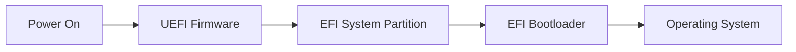
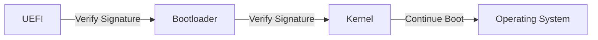
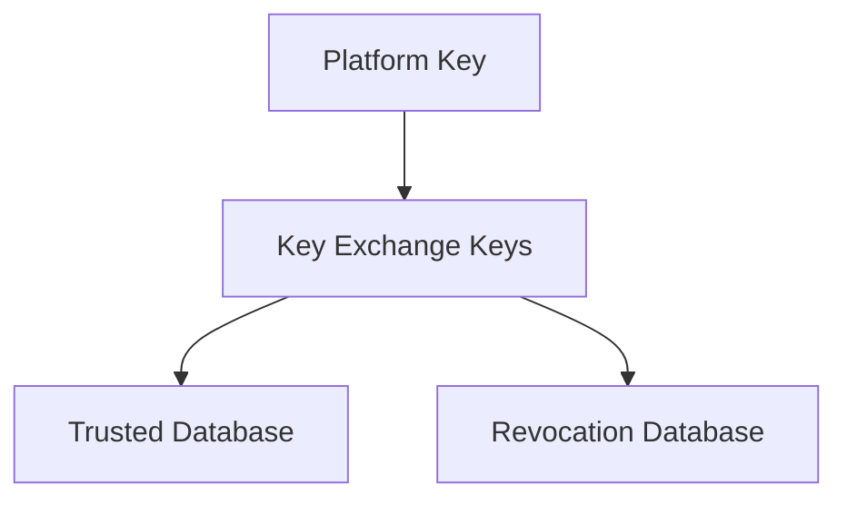
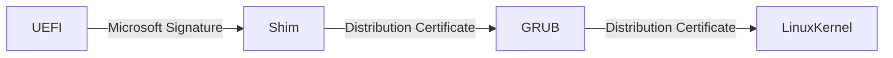
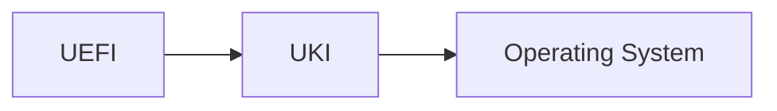

# Understanding BIOS, UEFI, and Secure Boot

Like many Linux users, I first encountered bootloaders while installing Arch Linux in my first year of college. I experimented with GRUB and later switched to systemd-boot, mostly because it felt simpler. Secure boot was something I routinely disabled because it got in the way, and I never questioned why.

That changed after spending some time on Fedora before returning to Arch. Fedora booted perfectly with Secure boot enabled, while Arch did not. Understanding why led me into reading about UEFI, Secure boot, Shim, Machine Owner Keys (MOK), firmware databases, certificate revocation, and more recently, Unified Kernel Images (UKIs). Well, I ended up with Secure boot enabled Arch installation too.

This post is an attempt to organize those ideas. Rather than treating BIOS, UEFI, and Secure boot as separate topics, it helps to see them as different stages in the evolution of how computers start.

# The Boot Process

When a computer powers on, the operating system is not yet running. The CPU begins executing instructions from a predefined location in firmware stored on the motherboard.

The firmware has only one responsibility: initialize enough hardware to load software that eventually loads the operating system.

Historically, this firmware was the Basic Input/Output System (BIOS). Modern systems use the Unified Extensible Firmware Interface (UEFI). Although both solve the same fundamental problem, their architectures are very different.

# BIOS: A Simpler Design From a Different Era

BIOS originated when operating systems were smaller and storage devices were simpler. Its boot process is remarkably straightforward.

he BIOS reads the first 512-byte sector of the selected boot device, known as the Master Boot Record (MBR), into memory and transfers execution to the boot code stored there. The firmware does not verify whether the bootloader has been modified. It assumes the code on disk is trustworthy. This simplicity made BIOS flexible and easy to implement, but it also meant that malware capable of modifying the bootloader could execute before the operating system had any opportunity to defend itself.

BIOS also inherited architectural limitations from its time, including the MBR partitioning scheme, disk size limits, and a relatively constrained execution environment.

# UEFI Replaces BIOS

UEFI approaches the boot process differently. Instead of executing raw code from the first disk sector, UEFI understands filesystems and loads executable files stored in a dedicated EFI System Partition (ESP).

EFI applications are simply executables stored on the ESP partition. A bootloader is one example of an EFI application, but firmware can also execute recovery tools, firmware update utilities, diagnostics, and other standalone programs.

Bootloaders became executables instead of being something written to first disk sector of MBR. Multiple operating systems can coexist without overwriting one another, firmware can maintain boot entries independently of disk layout, and recovery becomes significantly easier. This also introduced an optional mechanism called Secure Boot, allowing firmware to verify EFI executables before executing them.

# Why Secure Boot Exists

The operating system cannot protect itself until it begins running. If malicious software replaces the bootloader, the attacker gains control before any kernel security mechanisms are active.

Secure boot shifts trust into firmware.

Instead of asking whether a bootloader exists, UEFI asks whether it was signed by a trusted authority. If verification fails, execution stops before untrusted code runs. Each component verifies the next before handing over execution, which is commonly known as a chain of trust.

# The Firmware Databases

Secure Boot relies on several databases maintained inside firmware. Each exists for a different administrative purpose. The relationships between these components are easier to understand than their names. Atleast it was, for me.

| Database                | Purpose                                                 |
| ----------------------- | ------------------------------------------------------- |
| Platform Key (PK)       | Establishes ownership of Secure boot configuration      |
| Key Exchange Keys (KEK) | Authorize updates to trusted databases                  |
| DB                      | Stores trusted certificates and executable hashes       |
| DBX                     | Stores revoked or denyed certificates and binaries |

- The Platform Key sits at the top of the hierarchy. It identifies who controls and owns Secure boot configuration.
- The Key Exchange Keys (KEK) allows to update the trust databases.
- The DB contains certificates or hashes of executables that firmware accepts during boot.
- The DBX contains certificates or binaries that must never execute, even if they were previously trusted.

# Linux Introduces an Interesting Challenge

Most consumer machines ship with Microsoft Secure boot certificates already present in firmware, which allows Windows Boot Manager to boot without any additional configuration. For Linux distributions, the OEMs it would be a challenge indeed include signing certificates for every Linux distribution. 

The solution adopted by most mainstream distributions is introducing a compatibiltiy layer, also called shim.

Shim is a EFI application, which is signed through Microsoft. It then verifies the next component using certificates supplied by the Linux distribution, extending the chain of trust without requiring firmware vendors to ship distribution-specific keys.

> Before shim (developed by Redhat) became the standard, the Linux Foundation maintained Preloader. Rather than trusting certificates, PreLoader relied primarily on manually enrolled hashes through HashTool.

# Machine Owner Keys (MOK)

Machine Owner Keys (MOK) are used when Secure Boot needs to trust software that cannot be signed with a distributor's private key. Common examples include third-party Linux kernel modules, such as NVIDIA drivers back in the days (I am unaware of the current state) or VirtualBox, and locally built kernels.

Since distributor private keys are not publicly available (obviously), users generate their own signing certificate instead. This certificate is enrolled into the MOK database through Shim, after which the user can sign their own kernels or kernel modules. The MOK enrollment is handled by a separate EFI application called MokManager, which ships with the Shim.

Shim uses the MOK database as an additional source of trusted certificates. When Secure Boot is enabled, Shim can verify locally signed kernels and kernel modules using certificates stored in the MOK database, allowing them to boot or load successfully without modifying the firmware's Secure Boot databases. UEFI firmware itself never consults the MOK database. Firmware only verifies Shim using the standard Secure Boot trust chain. The MOK mechanism is implemented entirely by Shim, which extends the trust model by performing additional verification against the enrolled Machine Owner Keys.

# Why Revocation Matters and Advancements in Revocation Mechanism

Trust is only useful if it can be withdrawn.

Undiscovered CVEs still exist in signed bootloaders. Even if they are discovered and reported, because it remains cryptographically signed, firmware would normally continue trusting it indefinitely. Also, replacing certificates across millions of computers would be disruptive. Instead, firmware vendors can distribute updates to the DBX, the revocation database. If a vulnerable binary or certificate appears there, Secure boot refuses to execute it even though it may have been trusted previously.

More recent Secure boot improvements also introduced Secure boot Advanced Targeting (SBAT).

# Secure Boot Advanced Targeting (SBAT)

Certificate revocation works, but it is often too coarse. Revoking an entire certificate invalidates every binary signed with that certificate, including software that may not be vulnerable. Other way is to constantly update the hashes of binaries which are not to be executed. With the challenge of fine grained approach, it also brings another challenge that firmware non-volatile storage is limited.

Secure Boot Advanced Targeting (SBAT) introduces a more granular approach.

Instead of identifying software solely through certificates, boot components include metadata describing the vendor, product, generation, and version. This allows firmware to revoke only vulnerable releases while continuing to trust newer versions signed by the same certificate.

# Unified Kernel Images

One of the more recent developments in the Linux boot ecosystem is the adoption of Unified Kernel Images (UKIs). As discussed earlier, booting Linux involves several independent pieces.

The bootloader loads the kernel, the kernel loads the initial RAM filesystem (initramfs), and finally the real root filesystem is mounted.

For the chain of trust to work here, it has to trust the whole chain. A Unified Kernel Image combines these components into a single signed EFI executable.

A UKI typically contains:
- the Linux kernel
- the initramfs
- the kernel command line
- metadata used by Secure Boot

Many modern cloud images like Fedora ones and immutable Linux distributions increasingly ship with UKIs for exactly this reason. The resulting boot process is smaller, easier to verify, and aligns well with Secure Boot's chain of trust. Also, the kernel inside a UKI is built with the EFI stub, allowing it to behave as a native EFI application. From UEFI's perspective, a UKI is simply another EFI executable, allowing firmware or shim to verify and launch it directly without requiring a traditional bootloader.

I mean, from what I understand, they are not replacing traditional bootloaders because it does way more things than a UKI, it is rather a design for systems where a simpler and more verifiable boot path is desirable.

# Brain does Thinking

Happy Nerding Fellas.
