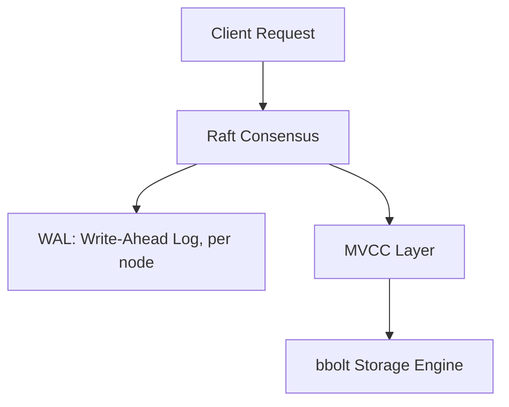
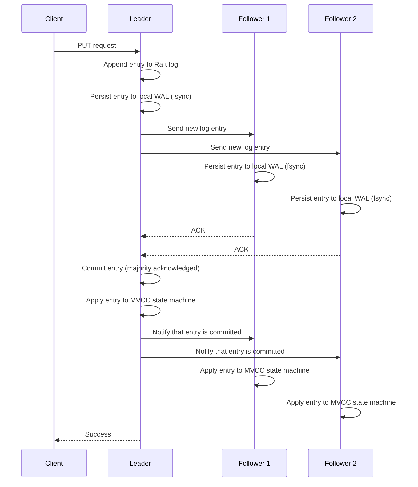
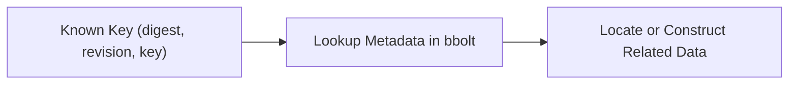
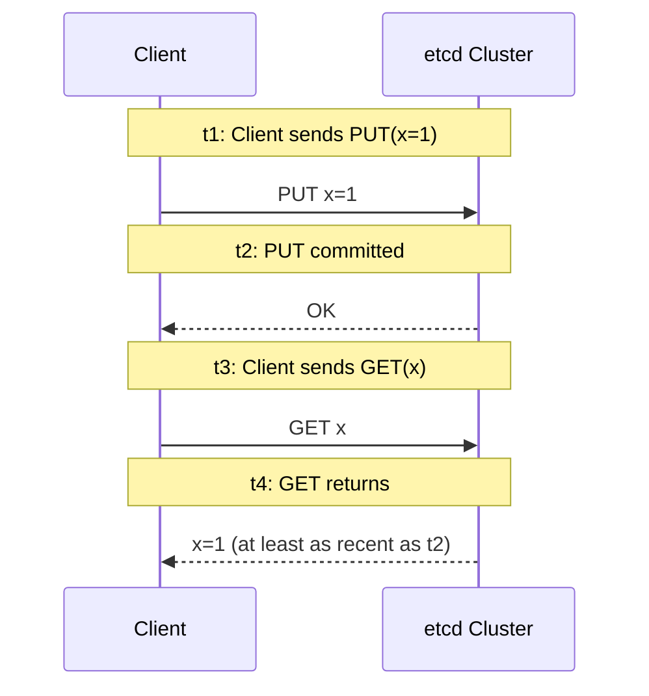
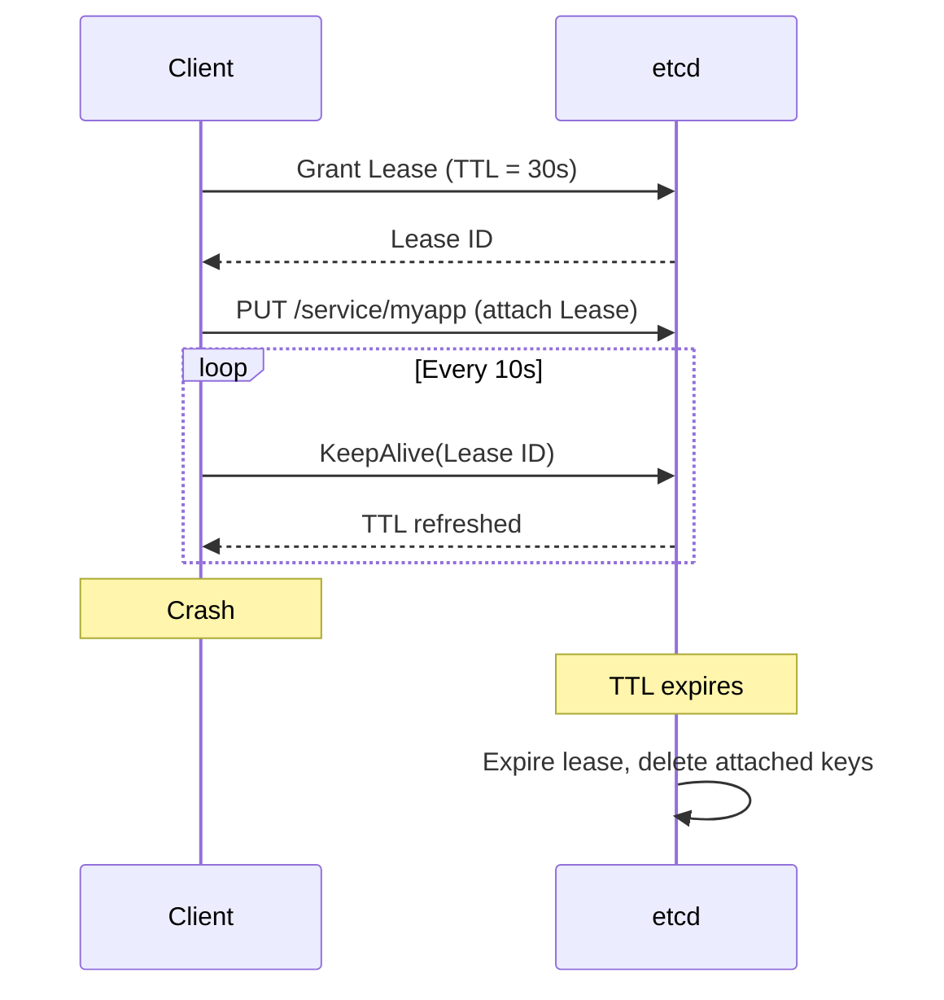
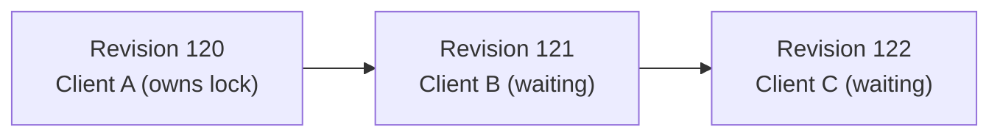

# Learning etcd

This weekend, I've been spending time understanding how etcd works internally. It started with a fairly simple goal: I wanted to understand what actually happens when a Kubernetes control plane stores state, elects a leader, or recovers from failures. Although I already know that etcd is a distributed key-value store with a focus on consistency backed by Raft, I still wanted to see why it is the way it is.

Here is my attempt to document that understanding.

# Layers in etcd

Well, etcd is distributed as a single binary, but a better way to view it probably, is as a collection of layers, each solving a specific problem and handing its result to the next one.



A client request does not immediately modify a database on disk. Before anything is persisted, the cluster first needs to agree that the operation should happen. That part is taken care of by Raft. Each node in the cluster records every Raft state change in its Write-Ahead Log (WAL), ensuring crash recovery is always possible. Once consensus is reached and the log entry is safely on disk, the operation enters the MVCC layer, which represents that agreed history as versioned data. Finally, those versions are persisted by bbolt, an embedded key-value database.

# How Raft Builds a Shared History

A key-value store on a single machine is pretty straightforward: the machine receives a write, updates the value, persists to disk, and returns success.

Replicating that database across three nodes is also pretty simple if we ignore consistency and use asynchronous replication. However, etcd is designed as a highly consistent data store, so prioritising consistency introduces a coordination problem. The challenge is not the data itself, but the history. Every replica must reconstruct the exact same sequence of operations, regardless of the order in which requests initially arrive at different nodes.

Clients can send writes simultaneously and connect to any member in the cluster. Since only the leader can accept writes, followers forward these requests to the leader. Followers never decide the order of writes themselves, only the leader does. The leader establishes a single global order by appending each write to an append-only log. Every log entry records the term in which it was created, its index in the log, and the operation to execute. The leader appends the entry to its own log and then sends the new log entry to followers in parallel so they can append it to their own logs.

> A term is an election term, e.g. node X won and became leader in the 57th election, so the term is 57.

Followers persist the new log entry to their Write Ahead Log (WAL) using fsync (flushing it to disk) before acknowledging it. Once the leader receives acknowledgments from a majority of the cluster, it advances the commit index, marking the entry as committed. The leader then applies the committed entry to the state machine, i.e. the MVCC layer, whose state is persisted in bbolt, the embedded key-value store. Only after the write has been committed and applied does the leader return success to the client.

The leader also informs followers that the entry is now committed. Once followers learn that an entry has been committed, they apply it to their own state machines. Because every node applies the same log entries in the same order, every replica comes to the same state.



This sequence made me understand why etcd performance depends on both network and disk latency. The client's request does not complete until the leader has replicated the entry to a majority of the cluster and those nodes have durably persisted it to disk. So, every write involves at least one round trip between the leader and followers, plus an fsync on a majority of nodes.

Network partitions illustrate why this design is robust. In a three-node cluster, if one node becomes isolated from the other two, the isolated node can no longer form a majority for new log entries, so no new writes can be committed on that side. The two connected nodes can still form a quorum, elect a new leader if necessary, and continue accepting writes. When the partition heals, the isolated node discovers that it has fallen behind and receives the missing committed log entries from the current leader until it catches up. Any uncommitted entries that never reached a majority are discarded. The critical property is that a leader cannot commit new writes without confirmation from a majority of the cluster, which ensures that the commited order of log of the is consistent across the nodes.

Raft doesn't know what a Kubernetes Pod is. It doesn't understand Deployments, Services, or distributed locks. For Raft, every client request is simply another operation to be appended to the log. That scoped responsibility is what allows it to provide the guarantee that everything else in etcd depends on: the existence of a single, globally agreed sequence of operations. Everything built on top of etcd, from Kubernetes objects to distributed locks, inherits that guarantee by relying on the same replicated log.

# Inside the Write-Ahead Log

The Raft log lives in memory as an ordered list of entries, but it also needs to survive crashes. The WAL is a durable append-only file that records every Raft state change before anything is acknowledged to the client. If a node crashes and restarts, it reads its WAL to reconstruct exactly what happened before the crash. The Raft paper mostly talks about persisting three things: the log entries, the current term, and which node received the vote (votedFor). etcd implementation of WAL stores all of those, plus a few extras:

| Record Type | Contents |
|---|---|
| Entry | The Raft log entry (term, index, command) |
| HardState | Current term, votedFor, commit index |
| Snapshot | Term and index of the latest snapshot |
| Metadata | Cluster ID and Node ID |
| CRC | Checksum for integrity verification |

Storing everything in a single append-only stream means that after a restart, etcd can reconstruct almost the entire Raft state just from the WAL.

Also as mentioned earlier, these are append only, so the WAL never modifies old bytes. If Raft decides that an entry at a given index should be replaced (for example, after a new leader is elected and conflicts are resolved), the WAL doesn't edit the old entry in place. It appends a new copy, and the new version supersedes the old one during recovery. This happens because Raft allows uncommitted entries to be overwritten. Suppose a leader in term 2 appends entry 10. Before it can replicate entry 10 to a majority, it crashes. A new leader is elected in term 3 with a shorter log that only goes up to index 9. The new leader now appends its own entry 10 with term 3. The WAL on the old leader's disk (or any follower that received entry 10) will physically contain:

```
Entry(10, term=2)   ← from old leader
Entry(10, term=3)   ← from new leader
```

Both bytes exist on disk. During recovery, etcd processes records sequentially. It stores Entry(10, term=2) first, then replaces it with Entry(10, term=3) when the latter appears. The final log contains entry 10 from term 3. The old copy is never touched but is simply ignored. The only entries that are truly permanent are those below the commit index recorded in the most recent HardState. Anything above it is tentative and might be replaced on the next leader change.

## Recovery

When a node restarts, it reads its WAL files in sequence. It processes records one by one:

1. **Snapshots**: Loads the latest snapshot, which represents a compressed version of the state machine at a specific index. This avoids replaying every entry since the beginning of time.
2. **HardState records**: Keeps only the most recent one. This tells the node its current term, which node it voted for, and the highest committed index.
3. **Entries**: Builds the log, keeping only the newest version of any conflicting (same index) entries.
4. **CRC verification**: Each record is checked for corruption.

The result is a reconstructed Raft log and state that is identical to what existed before the crash.

Snapshots are what keeps recovery fast. Without snapshots, a node that had processed a lot of log entries, lets say a million, would need to replay all of them after every restart. With snapshots, the node loads the latest snapshot (which contains the complete state at, say, index 300,000) and only replays entries after that point. When a follower falls far behind and the leader no longer has the old log entries, the leader sends a snapshot directly. The follower applies the snapshot and then continues with normal replication from that point forward.

# MVCC (Multi-Version Concurrency Control)

Once the cluster agrees on what happened, etcd has to decide how to represent that history. If all etcd needed was to return the current value for a key, overwriting the previous value would be the simplest design.

Kubernetes asks questions that depend on change: 
- Has this object been modified since I last checked? 
- Can I resume watching from where I disconnected? 
- Is the state I'm about to update still what I originally read? 

These questions are not about values, they are about history. 

MVCC preserves that history by keeping multiple versions of each value alive. But the important detail is that revisions are global, not per key. Every successful write anywhere in the database advances a single global revision counter. The database configuration key jumps from Revision 1 to Revision 4 not because it was updated three times, but because writes to other keys happened in between. This makes sense when you connect it back to Raft, which established a total ordering of operations, and MVCC preserves that ordering by assigning each committed entry the next revision number. The revision doesn't describe the history of a single key, it describes the history of the entire cluster.

In etcd, when you read a key, the response includes two additional fields: **mod_revision** and **version**. They sound similar but serve different purposes. Consider our database configuration key again, this time showing all the writes happening across the cluster:

```
Global Rev 1: PUT /config/database = mysql     → mod_revision=1, version=1
Global Rev 2: PUT /nodes/node1 = Ready        (different key)
Global Rev 3: PUT /pods/frontend = Running     (different key)
Global Rev 4: PUT /config/database = postgres  → mod_revision=4, version=2
Global Rev 9: PUT /config/database = mongodb   → mod_revision=9, version=3
```

**mod_revision** is the global revision at which this specific key was last written. After the third write, `/config/database` has mod_revision 9, because that write happened at global revision 9. This directly connects the per key change to a position in the cluster-wide timeline. It's what transactions use for optimistic concurrency, you read a key, note its mod_revision, then in a later transaction you compare that the key's mod_revision hasn't changed before writing.

**version** is a per-key counter that starts at 1 when the key is created and increments on each subsequent write to that same key. Unlike mod_revision, it doesn't correspond to any global position. The database key was written three times, so its version is 3. It arrived at that number across global revisions 1, 4, and 9 because other keys were modified in between, but version doesn't track the gaps, it only counts modifications to that one key. This is useful for scenarios where you need to know if the number of changes to a key has grown, regardless of what else happened in the cluster.

If you've used MVCC databases like MySQL or PostgreSQL, the term "MVCC" probably means something different from what I just described. In SQL databases, MVCC is primarily a concurrency mechanism. It lets readers continue seeing a consistent view of the database even while other transactions are modifying the same data. If you're halfway through a query and someone updates a row, your query doesn't suddenly see the new value, it keeps seeing the version that existed when your transaction began. This is what allows readers and writers to proceed without blocking each other.

etcd's MVCC serves a fundamentally different purpose. Raft already serializes all writes into a single linearized order, so etcd doesn't need MVCC to coordinate concurrent transactions. Instead, it uses versioning to preserve that global history. Rather than exposing only the latest value for a key, etcd keeps every version until it's explicitly compacted, allowing clients to read the state of the cluster at any revision. In contrast, SQL databases preserve older versions only long enough to ensure active transactions go well, once no transaction needs them anymore, those versions disappear.

| SQL MVCC                               | etcd MVCC                                |
| -------------------------------------- | ---------------------------------------- |
| Keeps old versions temporarily     | Keeps every version until compaction |
| Snapshot by transaction start time | Snapshot by requested revision       |
| Concurrency control                | Historical versioning                |

This distinction matters because it explains why etcd can support features like watches and linearizable transactions natively. The history is not a side effect of concurrency control, instead it is the primary data structure. Clients do not just see "the current value," they can navigate the cluster entire timeline.

Revisions are logical timestamps that represent a position in the shared history, unaffected by clock skew or machine boundaries. This lets clients read a consistent snapshot at a specific revision while writes continue in the background. Once that global revision exists, features throughout etcd start using it as a common reference point. E.g. watch ask "tell me what happened after Revision 1500" or the transactions check "has anyone modified this key since Revision 824?".

# Persistence with bbolt

In etcd, Raft handles coordination and consensus. MVCC handles versioning and historical reads. But when it comes to actually persisting all of that data to disk, etcd relies on bbolt. It is an embedded key-value database. It has no idea what MVCC is, and it certainly doesn't know anything about Raft or distributed systems. As far as it is concerned, it is running inside a single process on a single machine, storing pages on disk and making sure committed transactions survive crashes. Everything else is built on top of it.

> bbolt is a community-maintained fork of the original BoltDB. BoltDB was created as an embedded key-value database with ACID transactions and a single-file storage model. After the original project was archived, the community forked it to create bbolt, which continues to be actively maintained.

## Copy on Write Pages

Internally, bbolt stores its data in a B+tree, but the important detail for etcd is that the tree is copy-on-write. When a write transaction updates a key, bbolt never overwrites existing pages. Instead, it allocates new pages for the modified path through the tree, leaving the old pages untouched. Any read transaction that started before the write continues reading the old pages, while new transactions see the updated tree.

## Single Writer, Multi Reader Model

bbolt allows only one read-write transaction at a time, while any number of read-only transactions can run concurrently, which fits in with the workload type of etcd. Raft already serializes every write into a single global order, so there is never a need for multiple concurrent writers. Applied Raft entries are simply committed to bbolt one after another, while readers continue accessing older snapshots through copy-on-write pages.

## Space reclamation
When old pages are no longer referenced by any active transaction, they become reusable. However, the database file itself does not automatically shrink after deletions. Instead, etcd periodically performs defragmentation, rewriting the database into a new file and reclaiming unused space.

## Why not SQLite?

At first glance, SQLite looks like it would fit perfectly, infact Kine uses it. It's also an embedded, ACID database that stores everything in a single file. So why does etcd use bbolt instead?

The answer is that etcd doesn't need a relational database or a SQL query engine. It already knows exactly how its data is organized, i.e. everything is a key-value pair. Adding SQL parsing, query planning, indexes, and the relational model would just introduce complexity that etcd never uses. More importantly, bbolt's programming model aligns naturally with etcd's architecture. It provides a simple ordered key-value store with copy-on-write transactions and a single-writer model—the same assumptions Raft already makes by serializing all writes through the leader. 

| SQLite                              | bbolt                         |
| ----------------------------------- | ----------------------------- |
| General-purpose relational database | Simple ordered KV store       |
| SQL engine                          | No query language             |
| Designed for arbitrary applications | Designed as a storage library |
| Rich features                       | Minimal primitives            |

etcd can build MVCC, watches, leases, and the rest of its functionality directly on top of that primitive without actively trying to abstract away the storage engine. Well, in this case, this is not a storage engine, this is a full blown database.

# Why this works for etcd

This pattern appears in other projects too. BuildKit, the container image build system, also uses bbolt. At first that seems unrelated, but the workloads share an important characteristic. BuildKit stores metadata about build cache entries, snapshots, content digests, and dependency graphs. It already knows the key, e.g. a digest, a snapshot ID, a cache identifier and just needs to look up the associated metadata transactionally. It is not running exploratory queries or analytical scans. That is the same workload etcd has: most operations already know the key and just need efficient, transactional lookups. An embedded key-value store that excels at key-based access with ACID guarantees is a natural fit for both.



The fsync behavior I mentioned during Raft's commit flow is worth revisiting here because it's a practical concern when running etcd. Every bbolt transaction commit calls fsync to ensure data is on disk before returning success. This happens when the leader applies committed entries to the state machine. Since the leader must wait for a majority of followers to fsync their WALs before responding to the client, the write latency a client experiences is roughly: one network round trip to the leader + parallel replication to followers (network + WAL fsync on each) + response back. The slowest step tends to be the disk fsync, which is why etcd documentation strongly recommends SSDs with low fsync latency and warns against shared or networked filesystems like NFS.

> Have you ever run sqlite with NFS? xd

# Gurantees Provided by etcd

All of these layers, i.e. Raft, WAL, MVCC and bbolt work together to deliver a set of guarantees that clients can rely on. Understanding these guarantees clarifies why certain design decisions were made and what trade-offs they involve.

## KV operations are strictly serializable

For KV operations (Put, Range, Delete, Txn), etcd provides **strict serializability**. This is the strongest isolation guarantee for a distributed database. It means:
- **Atomicity**: Each operation either completes entirely or not at all.
- **Total order**: All operations occur in a single global order that is consistent with real time. If operation A completes before operation B begins, A appears before B in the commit order.
- **Durability**: Once an operation completes, its effects are permanent. A read will never return data that hasn't been made durable.

Strict serializability is achieved through Raft: every write goes through consensus, which produces the total order. The revision assigned to each write operation is the observable manifestation of that order. Two operations that share the same revision were applied "concurrently" by the same transaction.

## Linearizability

From a client's perspective, strict serializability implies **linearizability**: each operation appears to take effect instantaneously at some point between when the client sent it and when the client received the response.



If a write completes at time t1, any read that starts after t1 must return the result of that write (or a later one). This is a powerful guarantee because it means clients don't need to worry about stale reads.

Linearizability comes with a cost: linearizable requests must go through the Raft consensus process, which adds latency. For read-heavy workloads that can tolerate slightly stale data, etcd offers a **serializable** read mode that bypasses consensus and reads directly from the local node's state machine. This is faster but may return data that doesn't reflect the latest committed writes.

## Watch guarantees

Watches subscribe to changes over a key range. They make the following guarantees:
- **Ordered**: Events are delivered in revision order. You will never see a later event before an earlier one.
- **Unique**: Each event is delivered exactly once.
- **Reliable**: No events are dropped within the available history window. If events A, B, and C occur in that order, and you receive A and C, you are guaranteed to also receive B. The final sequence you observe will always be A, B, C (assuming those revisions haven't been compacted).
- **Atomic**: Events from a single transaction (which may touch multiple keys) are delivered together in one response. You never see partial results.
- **Resumable**: If a watch connection breaks, you can create a new watch starting from the last revision you received. As long as that revision hasn't been compacted away, you won't miss anything.
- **Bookmarkable**: etcd sends periodic progress notifications that guarantee all events up to a certain revision have been delivered.

Watches are not linearizable. The revision field on each event tells you where it falls in the global order, so you can reconcile watch events with other operations yourself.

## Lease behavior

Leases follow the same durability rules: a lease is durable once its Grant operation commits. However, lease expiration is driven by wall-clock time, not by Raft consensus, hence its behavior is a bit different. Each node independently tracks lease TTLs based on its own clock. When a lease expires, the node that detects the expiration proposes the deletion through Raft. This means clock skew between nodes can affect the precise moment a lease expires.

# Leases

The core problem is that in a distributed system, processes claim temporary ownership of things, e.g. a service registering itself, a controller becoming leader, a worker claiming a task. The difficult question is what happens when the process disappears. Machines lose power, containers are killed, networks fail before graceful shutdown completes. If ownership depended on explicit cleanup, stale information would accumulate quickly.
 
etcd solves this by making temporary ownership a first-class concept. A client requests a lease with a configurable TTL, then attaches keys to it. As long as the client periodically renews the lease before the TTL expires, the attached keys remain valid. If the client stops sending keepalives, maybe it was part of crash, partition, termination, the lease expires and all attached keys are deleted automatically.



This shifts responsibility away from clients remembering to clean up after themselves. In a system where assuming graceful shutdown is optimistic, that's a significant improvement in robustness. The same idea appears far beyond etcd. DHCP uses leases for IP assignment. Cloud platforms use similar mechanisms for resource coordination. The pattern is always the same: ownership should be temporary unless someone actively proves it still exists.

# Locks, Leader Election, and Composition

Distributed locks are not built alongside leases, rather they're built from leases. When a client acquires a lock, it creates a key under a well-known prefix and attaches that key to a lease. The lock's existence is tied to the lease: if the client crashes, the lease expires, and the lock disappears without explicit cleanup.

But leases only solve the lifecycle problem. They don't determine who holds the lock when multiple clients compete simultaneously. That's where revisions come in.

Every committed operation has a globally agreed revision. When Client A creates its lock key, that write gets Revision 120. Client B's attempt gets Revision 121. Every cluster member agrees that 120 happened before 121 because Raft and MVCC already established that ordering. The client holding the earliest creation revision owns the lock. Everyone else waits.



# Still Learning

It looks like this is the end of my context window for now haha. But to be honest, I think I still have plenty of gaps in my understanding, and I expect it to improve as I spend more time with playing around with etcd, even though I have experience running Kubernetes clusters in production and I have tuned timeouts for controllers before for it to not be stuck in restart loop due to network latencies, but direct interaction with etcd gives working with Kubernetes a different perspective. Right now I'm working with simulating failure scenarios in a small 3 node cluster at home, killing leaders, introducing latency to network paths between nodes, watching what happens to watches during partitions, and seeing how systems behave.