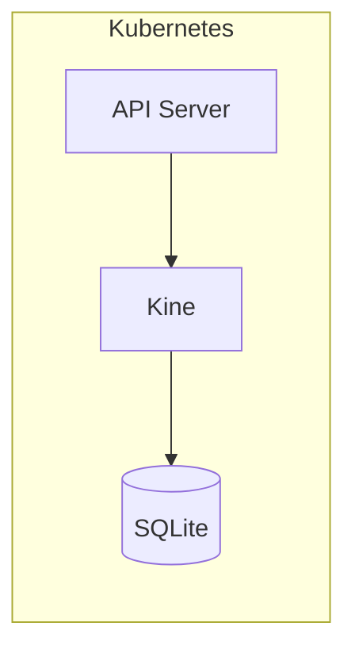
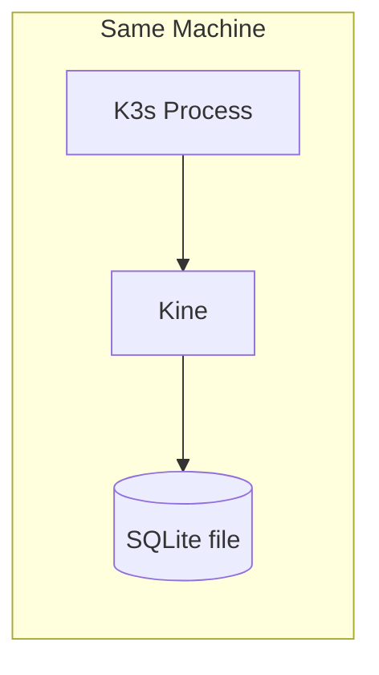
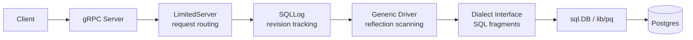
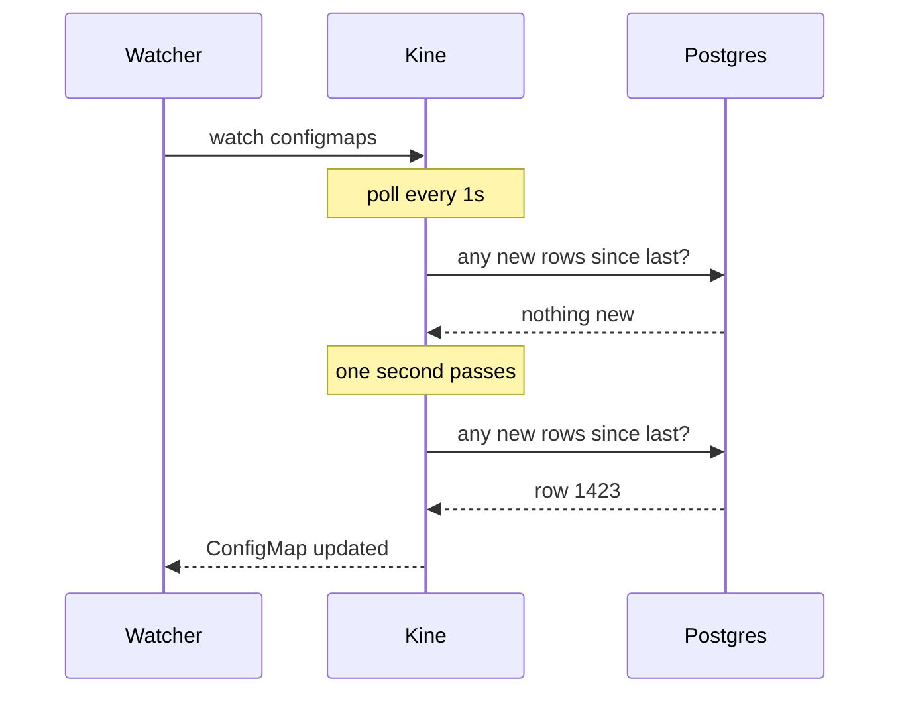
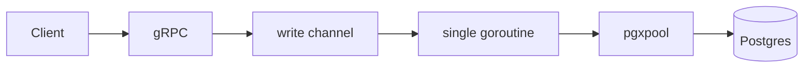
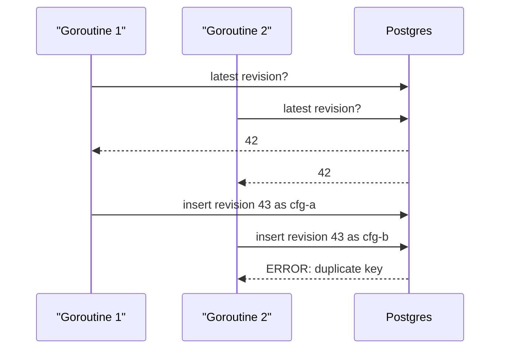
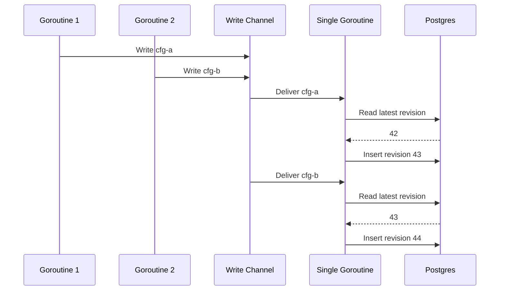
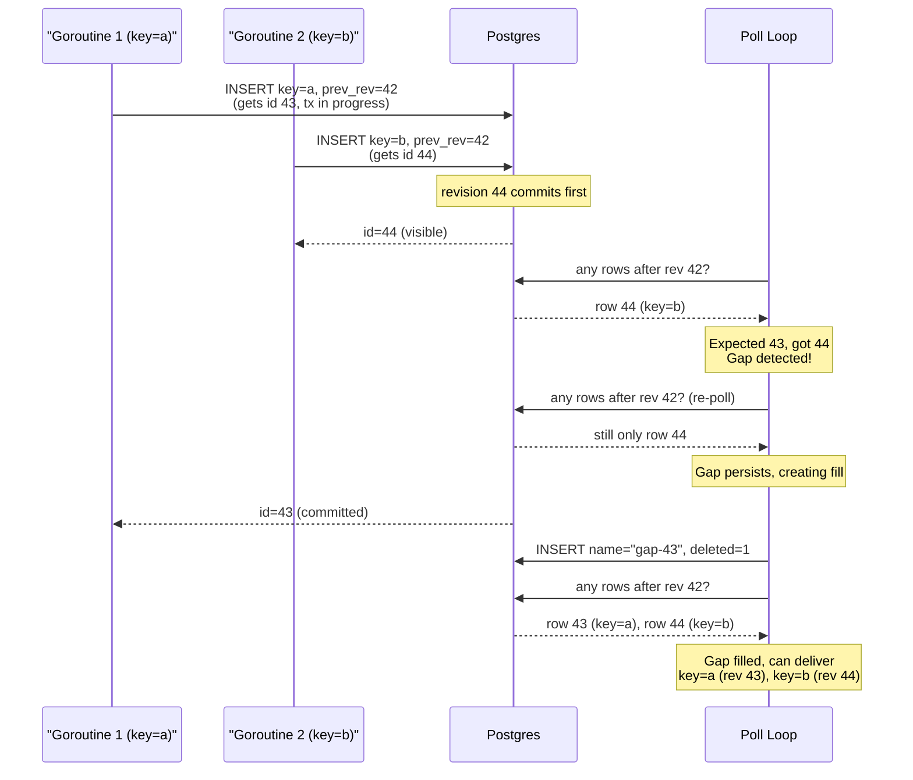
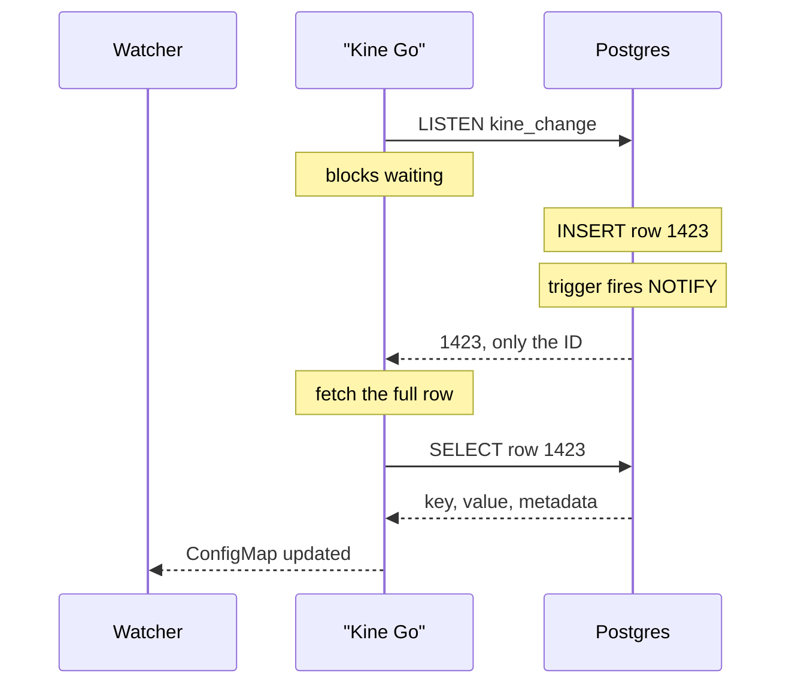

# Weekend Side Project with Kine

I noticed something interesting while working with K3s recently. Like many people, I have used it for single-node Kubernetes deployments because it is a super easy one-liner to get running. But I started wondering: how exactly does K3s replace etcd with SQLite? So this weekend, I cloned the repo and tried to trace the flows.

I had recently read about `LISTEN/NOTIFY` in Postgres and was curious if Kine used it for its Postgres backend. While me attempting to understand the codebase, it turned out there was a heavily layered flow, with each database backend abstracted out. From what I understood, the goal was to ensure consistency of operations across all relational database backends like MySQL, SQLite, and PostgreSQL.

Instead of using `LISTEN/NOTIFY`, I noticed there was a polling loop that checked for updates. I wondered what would happen if I stripped out every backend except Postgres and wrote a native implementation using the `pgx` library directly. This article is my attempt to organize what I learned from that process.

> A quick note before we begin:
>
> This started as a weekend side project driven by curiosity. The implementation, benchmarks, and conclusions here should be treated as observations from my experiments, not definitive technical results. I've never operated PostgreSQL clusters at terabyte scale or Kubernetes clusters with 500 of nodes, so there are almost certainly trade-offs and production considerations that I have not encountered yet.

# The Problem Kine Solves

Before getting into the implementation details, it helps to step back and look at why Kine exists in the first place.

Kubernetes was designed around etcd. The guarantees that etcd provides, along with its performance in an ideal scenario, are absolutely critical for a well-performing Kubernetes cluster. But running etcd in production is operationally tasking, especially in environments where network drops and slow disks are common. A typical highly available setup requires at least three nodes, careful tuning the timeouts, and someone who understands etcd internals when things go wrong.

By design etcd halts writes if the cluster is unhealthy to prevent inconsistency. But in environments where network and disk reliability are not guaranteed or if I may, speculate that the cluster is a dev environment and not production but few applications from developers are running on it, having the cluster shut off completely can be a major issue.

K3s targets a different deployment profile: edge devices, Raspberry Pis, and single-node servers where a three-node etcd cluster is overkill. For these cases, SQLite is a much simpler dependency.



Kine translates etcd v3 gRPC calls into SQL operations. The API server doesn't know it is talking to a database instead of etcd. This means it is possible to get the standard Kubernetes API, backed by a traditional database.

This naturally leads to another question: why use Kine with a remote relational database instead of just SQLite? From what I could gather, it's mostly to escape the etcd management overhead while still running a multi-node cluster.

# When Kine Makes Sense (and When It Doesn't)

Here is the mental model that finally made it click for me: Kine makes perfect sense with SQLite, but the architecture gets a bit more complicated when introducing Postgres or MySQL over a network.

## Local Execution with SQLite

When Kine talks to SQLite, everything is local. The database is just a file on disk. There is no network hop, no connection pooling to manage, and no TLS termination between Kine and its storage. The entire read and write path stays within the same process.

For a single-node K3s cluster running on a Raspberry Pi at the edge or a small office server, this is ideal. It provides a working Kubernetes API without managing a single extra service.



## The Network Cost of Postgres

Swapping SQLite for a remote Postgres instance introduces a network hop. Every read and write now takes at least one round trip between Kine and the database. On a local network, that might be 1-2 milliseconds, but on a managed cloud database, it can often be 10-30 milliseconds. Each SQL query pays for latency before Postgres even starts processing it.

At the same time, Kine has to translate etcd's simple key-value operations into SQL queries involving joins, subqueries, and full table scans. A single `GET` in etcd is a hash lookup in an in-memory b-tree. In Kine, it translates to something like this:

```sql
SELECT latest_record.id,
       latest_record.name,
       latest_record.value,
       latest_record.created,
       latest_record.deleted,
       latest_record.create_revision,
       latest_record.lease
FROM (
    SELECT name, MAX(id) AS id
    FROM kine
    WHERE name = $1
    GROUP BY name
) AS latest
INNER JOIN kine AS latest_record
    ON latest_record.id = latest.id;
```

That is a subquery with a `GROUP BY` and an inner join just to retrieve a single key-value pair. The overhead isn't just the network, it is the SQL itself. By contrast, etcd is purpose-built for this workload. It stores revisions in a b-tree, watches are push-based, and there is no query planner, MVCC visibility rules, or buffer cache to manage. A `PUT` in etcd is a b-tree insert with a Raft round trip. A `PUT` in Kine involves multiple SQL queries, transaction overhead, and constraint checking. Even if the network was eliminated entirely by running Postgres on the same machine, the SQL translation layer would likely still be slower than native etcd. This is not a flaw in Kine's design but instead it is a fundamental consequence of putting a relational database between Kubernetes and its storage. The trade-off here is swapping the performance of a specialized key-value store for the operational simplicity of a familiar database.

# So Why Choose This Architecture?

For small to medium Kubernetes clusters, this overhead rarely matters. A single-node K3s cluster with SQLite handles dozens of pods effortlessly. A small multi-node cluster backed by a managed Postgres instance can handle hundreds. The bottleneck in these clusters is rarely the storage layer—it's usually the application workload itself.

The typical profile for this deployment pattern seems to be:
- Teams without dedicated infrastructure engineers.
- Environments already using a managed database provider (RDS, Cloud SQL, Supabase).
- Situations where operating an etcd cluster (backups, tuning, monitoring) is too costly.
- Deployments that need a reliable Kubernetes API but don't strictly require millisecond-level latency for control plane operations.

In these scenarios, hooking Kine up to an existing Postgres database is a pragmatic choice. The performance gap is real but often irrelevant for the workloads being run.

# How the Original Kine Worked

The original architecture had a clear goal: support multiple databases with a single code path. Every backend had to implement the same operations, but the databases differed in their SQL queries, transaction semantics, and watch mechanisms. The compromise was a layered design that looked something like this:



Each layer had a specific job:
- The gRPC server received requests and routed them.
- The `LimitedServer` determined whether a request was a create, update, delete, or range.
- The SQLLog layer tracked revision IDs and constructed SQL statements.
- The Generic Driver used Go's `database/sql` interface and reflection to map database rows back into Go structs.
- The Dialect interface let each database provide its own SQL syntax (e.g., Postgres uses `INSERT ... RETURNING`, MySQL uses `REPLACE INTO`).

This structure made perfect sense for supporting many databases.

# The Watch Problem

The most interesting compromise I found was how Kine handled watch delivery. Postgres, MySQL, and SQLite don't share a universal push mechanism for arbitrary SQL queries. To work around this, Kine used a shared polling approach: a background goroutine polled the database every second for new rows, then broadcasted them to all active watchers.



This meant a controller watching for ConfigMap changes would see them up to a second late. Furthermore, the database was being queried even when nothing had changed. For a cluster with many watchers, every poll cycle multiplied into many row scans and comparisons. At this point, I wondered, if this could be improved by removing the generic layers and writing a backend exclusively for Postgres?

# What a Native Postgres Backend Looks Like

The fork I built this weekend started with a simple idea that what if Kine just supported Postgres, but did it really well? The write path collapsed from six layers to one:



# Why Serialize Writes?

The most interesting design decision I made during this experiment was introducing a write channel. Every create, update, delete, and compact request is sent to a single goroutine that processes them sequentially on a single database connection.

This seems counterintuitive at first: doesn't this lose all the benefits of concurrency? In most systems, yes. But Kine's data model has a specific property that makes serialization safe and effective: it relies on an **append-only MVCC** (Multi-Version Concurrency Control) model with monotonically increasing revision IDs. Every write creates a new row, and the revision is an auto-incrementing `id`. Without serialization, two concurrent goroutines could both compute the same "next" revision, causing conflicts:



With the serial channel, all writes are ordered through one goroutine:



The revision IDs stay monotonic, there are no gaps, no conflicts, and no need for `FOR UPDATE` row locks. The trade-off is throughput, since the write loop becomes a single bottleneck. However, that bottleneck doesn't really matter when every write is already waiting 10-30ms for a network round trip to the database. The serial channel adds almost no measurable overhead when the network is the dominant factor.

In the original Kine, multiple goroutines called `Append()` directly against the database. The `(name, prev_revision)` unique index prevented corruption for same-key writes (one succeeds, the other gets `ErrKeyExists`). But concurrent writes to different keys could commit out of order, creating gaps that the poll loop had to patch with synthetic fill records.



Consider two goroutines writing different keys concurrently to the table. Although revision 43 is assigned first, revision 44 commits first and becomes visible to the poll loop. The poll loop sees that revision 43 is missing, detects a gap, and inserts a synthetic fill record. When the transaction for revision 43 later commits, the poll loop processes revisions 43 and 44 in order. This keeps the revision sequence contiguous and provides the same ordering guarantee as etcd.

# Watch Delivery Without Polling

The other big change was replacing the 1-second poll loop with Postgres's built-in `LISTEN/NOTIFY` mechanism.

On startup, the backend creates a database trigger on the `kine` table. Every time a row is inserted, the trigger calls `pg_notify`, which pushes a notification to any connected client listening on that channel. The Go side runs a dedicated connection that blocks on `WaitForNotification`, waiting for the next event. But there is a limitation here: Postgres `NOTIFY` payloads are capped at about 8 KB. Real etcd watch events can include the full key and value, up to 1.5 MB. Because of this, the entire event can't be stuffed into the notification. Instead, only the new revision ID is sent. The Go side receives the notification, then performs a point query to fetch the actual row data before delivering it to watchers.



This extra round trip is a direct consequence of the `NOTIFY` payload limit. In a real etcd cluster, the notification is the data. With Kine, the notification is just a signal that new data exists. Still, watch delivery drops from up to a second down to roughly a millisecond of processing time plus a single round trip. This is a massive improvement over polling. Plus, the database only does work when there's an actual change.

# Numbers for the Experiment

To see how much the network actually dominates, I ran the etcd benchmark tool against both the original Kine v0.16.3 and the new native Postgres backend, pointing both at the same remote Postgres instance. I'm definitely not claiming this is a rigorous benchmark: it is just what I ran on a Sunday evening against a database on a different machine. Take the numbers as directional.

The benchmark covered four operation types:
- **put sequential** — writes with monotonically increasing keys (similar to how the Kubernetes API server creates resources).
- **put random** — writes with random keys.
- **range point** — single-key reads by exact name (the most common read pattern in Kubernetes).
- **watch** — streaming watch requests.

Here is what I found:

| Operation | Original v0.16.3 | New backend | Difference |
|---|---|---|---|
| **put sequential avg** | 192ms | 173ms | -10% |
| p50 / p99 | 184ms / 318ms | 159ms / 347ms | |
| **put random avg** | 194ms | 175ms | -10% |
| p50 / p99 | 185ms / 337ms | 161ms / 333ms | |
| **range point avg** | 10.8ms | 12.2ms | +13% |
| p50 / p99 | 9.7ms / 40ms | 9.9ms / 51ms | |
| **watch avg** | 0.2ms | 0.2ms | identical |

The exact commands used for each operation were identical to before, running 5,000 operations with 10 concurrent clients.

The writes showed a modest 10% improvement in the new backend. This is roughly the difference between five SQL round trips (old) and two (new) at about 30ms each over a remote connection. The two backends were nearly indistinguishable for range and watch operations. If this were a local Postgres instance with sub-millisecond latency, the improvement would likely be much larger because the query count would dominate execution time instead of being drowned out by the network. But as mentioned earlier, running Kine against a local Postgres doesn't make much sense when SQLite exists.

# End of the Weekend

I started this project purely out of curiosity to see what would happen if the generic abstractions were stripped away. I naively assumed that leveraging Postgres directly would make it significantly faster. But the performance improvement was modest, simply because the network was the limiting factor all along.

This experiment finally clarified my mental model of Kine: it isn't trying to be faster than etcd. It is simply offering a different trade-off. It accepts lower storage performance in exchange for not having to operate an etcd cluster. For small to medium Kubernetes clusters, that is a trade-off worth making. The database was the bottleneck the whole time, and that's okay, because it is a piece of infrastructure many teams already know how to manage.

Hopefully this organized the topic into a mental model rather than a collection of unrelated concepts.